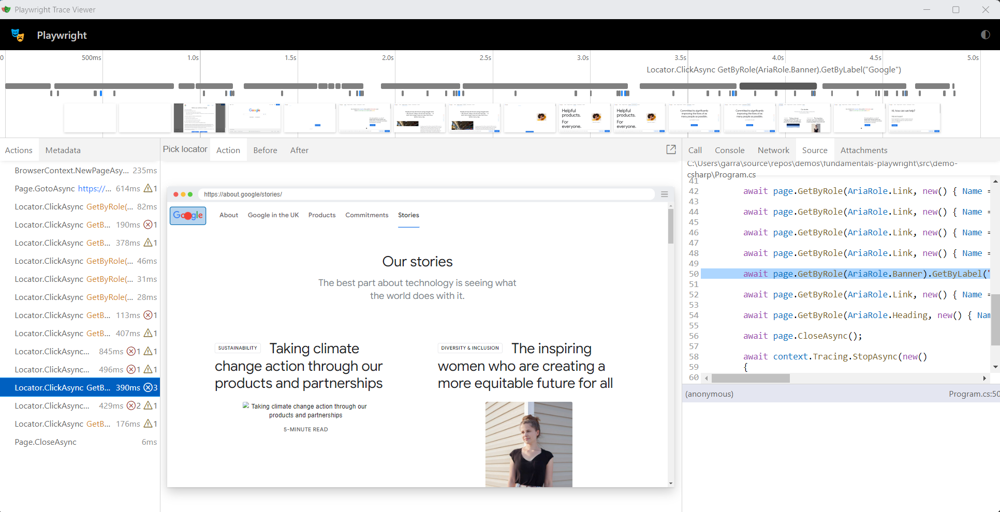

# fundamentals-playwright

## Demos

| Demo | Summary | Runtime |
| :- | :- | :- |
| [Demo 1](#demo-1) | Create a basic .NET Core console app and use script generated from OpenAI | .NET Core |
| [Demo 2](#demo-2) | Record automation | .NET Core |
| [Demo 3](#demo-3) | The Inspector | .NET Core |
| [Demo 4](#demo-4) | Trace | .NET Core |
| [Demo 5](#demo-5) | Azure Functions App Linux Consumption provisioned using the AZ Developer CLI (AZD) | NodeJS (Linux consumption Functions App), Razor Pages in ASP.NET Core |
| [Code Snippets](#code-snippets) | Short code snippets | NodeJS, .NET Core |


---

## Demo 1

**Introduction**

```powershell
mkdir src/demo-1
cd src/demo-1
dotnet new console -f net6.0
dotnet add package Microsoft.Playwright --version 1.38.0
dotnet build
pwsh .\bin\Debug\net6.0\playwright.ps1 install
```

👆 Note that all engines (chromium, firefox & webkit) are installed

**Prompt engineering**: "Create me c# script using ms playwright to confirm the word google is on the page having navigated to google.com"

```c#
using Microsoft.Playwright;

class Program
{
    static async Task Main(string[] args)
    {
        using var playwright = await Playwright.CreateAsync();
        await using var browser = await playwright.Firefox.LaunchAsync();
        var page = await browser.NewPageAsync();
        await page.GotoAsync("https://google.com");
        var content = await page.ContentAsync();
        bool isGooglePresent = content.Contains("google", StringComparison.OrdinalIgnoreCase);
        Console.WriteLine($"Is 'google' present on the page? {isGooglePresent}");
    }
}
```

```powershell
dotnet run
```

**Prompt engineering**: "I'd like this script to not be headless" 

```c#
using Microsoft.Playwright;

class Program
{
    static async Task Main(string[] args)
    {
        using var playwright = await Playwright.CreateAsync();
        await using var browser = await playwright.Firefox.LaunchAsync(new BrowserTypeLaunchOptions { Headless = false });
        var page = await browser.NewPageAsync();
        await page.GotoAsync("https://google.com");
        var content = await page.ContentAsync();
        bool isGooglePresent = content.Contains("google", StringComparison.OrdinalIgnoreCase);
        Console.WriteLine($"Is 'google' present on the page? {isGooglePresent}");
    }
}
```

## Demo 2

**Record automation**

To save file, you need administrators rights:

Open up Powershell Terminal as Administrator, then:

```powershell
net localgroup administrators <username> /add
```

Next, open up Windows Terminal as Administrator.  You'll still get prompt but use your non-admin account to sign in.  

Then:

```powershell
mkdir src/demo-2
cd src/demo-2
dotnet new console -f net6.0
dotnet add package Microsoft.Playwright --version 1.38.0
dotnet build
pwsh .\bin\Debug\net6.0\playwright.ps1 install --with-deps firefox
pwsh .\bin\Debug\net6.0\playwright.ps1 codegen https://www.google.com/ -o ./Program.cs -b firefox
```

👆 Note that only firefox engines is installed

👆 Must press the **record** button

To see what you navigated - headed mode:
```
dotnet run
```


## Demo 3

**Playwright Inspector**

Your scripts might not run.  You can invoke the PW Inspector to help identify issues in your scripts.

```powershell
$env:PWDEBUG=1
dotnet run
```


---

## Demo 4

**Trace**

To see the trace

After line 14 (line 14):

```csharp
var context = await browser.NewContextAsync();
```

enter:

```csharp
var context = await browser.NewContextAsync();
await context.Tracing.StartAsync(new()
{
    Screenshots = true,
    Snapshots = true,
    Sources = true
});
```

then after line `await page.CloseAsync();`, enter:

```csharp
await page.CloseAsync();

await context.Tracing.StopAsync(new()
{
    Path = "trace.zip"
});
```

Now enter this to rerecord your navigation:

```
dotnet run
```

To view the trace:

```powershell
pwsh .\bin\Debug\net6.0\playwright.ps1 show-trace .\trace.zip
```

Example Trace:



---


## Demo 5

Azure Functions App Linux Consumption provisioned using the AZ Developer CLI (AZD)

Click [here](https://github.com/garrardkitchen/playwright-nodejs-func) to go to GitHub repo and follow instructions.

```
# Log in to azd. Only required once per-install.
azd auth logout # avoid any expired refresh tokens; you'll experience multiple auth challenges and a broken DX otherwise
azd auth login

# First-time project setup. Initialize a project in the current directory, using this template. 
azd init --environment "<env-name>" --template https://github.com/garrardkitchen/playwright-nodejs-func

# Provision and deploy to Azure
azd up
```

# Code snippets

## Launch Options

This snippet sets a timeout of 3 mins, disables the gpu and ignores all HTTPS related errors. This latter context configuration is helpful when running from a container.

```c#
using Microsoft.Playwright;

class Program
{
    static async Task Main(string[] args)
    {
        using var playwright = await Playwright.CreateAsync();
        await using var browser = await playwright.Firefox.LaunchAsync(new BrowserTypeLaunchOptions{
            Headless = true,
            Timeout = (1000 * 180),
            Args = new string[] {"--disable-gpu"}
        });
        var context = await browser.NewContextAsync(new BrowserNewContextOptions{
            IgnoreHTTPSErrors = true
        });
        var page = await context.NewPageAsync();
        await page.GotoAsync("https://google.com");
        var content = await page.ContentAsync();
        bool isGooglePresent = content.Contains("google", StringComparison.OrdinalIgnoreCase);
        Console.WriteLine($"Is 'google' present on the page? {isGooglePresent}");
    }
}
```