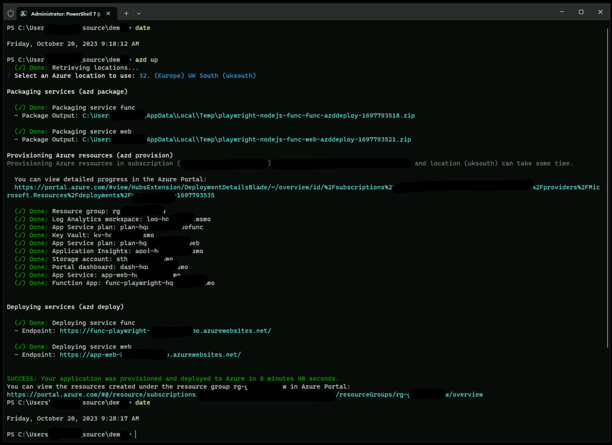

# fundamentals-playwright

## Demos

| Demo | Summary | Runtime |
| :- | :- | :- |
| [Demo 1](#demo-1) | Create a basic .NET Core console app and use script generated from OpenAI | .NET Core |
| [Demo 2](#demo-2) | Record automation | .NET Core |
| [Demo 3](#demo-3) | The Inspector | .NET Core |
| [Demo 4](#demo-4) | Trace | .NET Core |
| [Demo 5](#demo-5) | NUnit | .NET Core |
| [Demo 6](#demo-6) | UI mode & report | NodeJS |
| [Demo 7](#demo-7) | Azure Functions App Linux Consumption provisioned using the AZ Developer CLI (AZD) | NodeJS (Linux consumption Functions App), Razor Pages in ASP.NET Core |
| [Code Snippets](#code-snippets) | Short code snippets | NodeJS, .NET Core |

---

## PreDemo

Before running through the demos:

**Step 1**

To save a playwright file and to install the playwright dependencies (browser engines), you need administrators rights:

Open up Powershell Terminal as Administrator, then:

```powershell
net localgroup administrators <username> /add
```

👆 Replace `<username>` with your username.

Next, open up Windows Terminal as Administrator.  You'll still get prompt but use your non-admin account to sign in.  


**Step 2**

Remove all install playwright browser engine installs:

```powershell
pwsh .\bin\Debug\net6.0\playwright.ps1 uninstall --all
```

---

## Demo 1

**Step 1** - Setup

Create a console app and add package dependencies:

```powershell
mkdir src/demo-1
cd src/demo-1
dotnet new console -f net6.0
dotnet add package Microsoft.Playwright --version 1.38.0
dotnet build
pwsh .\bin\Debug\net6.0\playwright.ps1 install
```

👆 Note that all engines (chromium, firefox & webkit) are installed

**Step 2** - headless

ℹ️ open 📂 demo-1 VSCode

**Prompt engineering**: "Create me c# script using ms playwright to confirm the word google is on the page having navigated to google.com"

```c#
using Microsoft.Playwright;

class Program
{
    static async Task Main(string[] args)
    {
        using var playwright = await Playwright.CreateAsync();
        await using var browser = await playwright.Firefox.LaunchAsync();
        var page = await browser.NewPageAsync();
        await page.GotoAsync("https://google.com");
        var content = await page.ContentAsync();
        bool isGooglePresent = content.Contains("google", StringComparison.OrdinalIgnoreCase);
        Console.WriteLine($"Is 'google' present on the page? {isGooglePresent}");
    }
}
```

```powershell
dotnet run
```

**Step 3** - headed

**Prompt engineering**: "I'd like this script to not be headless" 

```c#
using Microsoft.Playwright;

class Program
{
    static async Task Main(string[] args)
    {
        using var playwright = await Playwright.CreateAsync();
        await using var browser = await playwright.Firefox.LaunchAsync(new BrowserTypeLaunchOptions { Headless = false });
        var page = await browser.NewPageAsync();
        await page.GotoAsync("https://google.com");
        var content = await page.ContentAsync();
        bool isGooglePresent = content.Contains("google", StringComparison.OrdinalIgnoreCase);
        Console.WriteLine($"Is 'google' present on the page? {isGooglePresent}");
    }
}
```

## Demo 2

**Step 1** - Setup

```powershell
mkdir src/demo-2
cd src/demo-2
dotnet new console -f net6.0
dotnet add package Microsoft.Playwright --version 1.38.0
dotnet build
pwsh .\bin\Debug\net6.0\playwright.ps1 install --with-deps firefox
```

👆 Note that only firefox engines is installed


**Step 2** - Record automation

ℹ️ open 📂 demo-2 VSCode

```powershell
pwsh .\bin\Debug\net6.0\playwright.ps1 codegen https://www.google.com/ -o ./Program.cs -b firefox
```

👆 Must press the **record** button

To see what you navigated - headed mode:
```
dotnet run
```


## Demo 3

**Playwright Inspector**

Your scripts might not run.  You can invoke the PW Inspector to help identify issues in your scripts.

```powershell
$env:PWDEBUG=1
dotnet run
```


---

## Demo 4

**Step 1** - Trace

To see the trace

After line 14 (line 14):

```csharp
var context = await browser.NewContextAsync();
```

enter:

```csharp
var context = await browser.NewContextAsync();
await context.Tracing.StartAsync(new()
{
    Screenshots = true,
    Snapshots = true,
    Sources = true
});
```

then after line `await page.CloseAsync();`, enter:

```csharp
await page.CloseAsync();

await context.Tracing.StopAsync(new()
{
    Path = "trace.zip"
});
```

Now enter this to rerecord your navigation:

```
dotnet run
```

**Step 2** - View trace file

To view the trace:

```powershell
pwsh .\bin\Debug\net6.0\playwright.ps1 show-trace .\trace.zip
```

Example Trace:


---

## Demo-5

ℹ️ open 📂 demo-5 VSCode

In this demo we will create basic unit tests with test categories.

**Step 1** - Setup

```powershell
mkdir demo-5
cd demo-5
dotnet new nunit
dotnet add package Microsoft.Playwright.NUnit
dotnet build
pwsh bin/Debug/net8.0/playwright.ps1 install firefox
```

👆 Note that only firefox engines is installed

**Step 2** - Add Unit tests with test category attributes

Copy this into UnitTest1.cs:

```c#
using System.Text.RegularExpressions;
using System.Threading.Tasks;
using Microsoft.Playwright;
using Microsoft.Playwright.NUnit;
using NUnit.Framework;

[Parallelizable(ParallelScope.Self)]
[TestFixture]
public class Tests : PageTest
{
    [Test]
    [Category("L0")]
    public async Task HomepageHasPlaywrightInTitleAndGetStartedLinkLinkingtoTheIntroPage()
    {
        await Page.GotoAsync("https://playwright.dev");

        // Expect a title "to contain" a substring.
        await Expect(Page).ToHaveTitleAsync(new Regex("Playwright"));

        // create a locator
        var getStarted = Page.GetByRole(AriaRole.Link, new() { Name = "Get started" });

        // Expect an attribute "to be strictly equal" to the value.
        await Expect(getStarted).ToHaveAttributeAsync("href", "/docs/intro");

        // Click the get started link.
        await getStarted.ClickAsync();

        // Expects the URL to contain intro.
        await Expect(Page).ToHaveURLAsync(new Regex(".*intro"));
    }

    [Test]
    [Category("L1")]
    public async Task L1TestHereJustToBeIgnored()
    {
      await Task.FromResult<bool>(true);
    }
}
```

**Step 3** - Run tests for L0s

```powershell
dotnet test --filter TestCategory="L0" -- Playwright.BrowserName=firefox
```

**Step 4** - Run tests in UI debugger mode

To debug test using UI debugger mode:

```powershell
$env:PWDEBUG=1; dotnet test --filter TestCategory="L0" -- Playwright.BrowserName=firefox
```

👆 Why don't you change a `locator` to see what happens

---

# 🗣️ 


## Demo-6

Here we create a basic TypeScript sample project, use the Firefox engine only and run the tests.

**Step 1** - Create TS project (but do not install all enginees):

```powershell
npm init playwright@latest -y
...
Getting started with writing end-to-end tests with Playwright:
Initializing project in '.'
√ Do you want to use TypeScript or JavaScript? · TypeScript
√ Where to put your end-to-end tests? · tests
√ Add a GitHub Actions workflow? (y/N) · false
√ Install Playwright browsers (can be done manually via 'npx playwright install')? (Y/n) · false
...
✔ Success! Created a Playwright Test project at C:\Users\****\demo-6

Inside that directory, you can run several commands:

  npx playwright test
    Runs the end-to-end tests.

  npx playwright test --ui
    Starts the interactive UI mode.

  npx playwright test --project=chromium
    Runs the tests only on Desktop Chrome.

  npx playwright test example
    Runs the tests in a specific file.

  npx playwright test --debug
    Runs the tests in debug mode.

  npx playwright codegen
    Auto generate tests with Codegen.

We suggest that you begin by typing:

    npx playwright test

And check out the following files:
  - .\tests\example.spec.ts - Example end-to-end test
  - .\tests-examples\demo-todo-app.spec.ts - Demo Todo App end-to-end tests
  - .\playwright.config.ts - Playwright Test configuration
```

👆 This will have created a config (demo-6/playwright.config.ts) file with defaults. For example, `testDir`, informing where your tests are located

**Step 2** - Install the firefox engine only:

```powershell
npx playwright install firefox
```

Let's now run the tests. This will throw up a reports page - errors. Observe the chromium & webkit tests fail due to us not installing these engines earlier:

**Step 3** - Execute the tests:

```powershell
npx playwright test --project=firefox
```

👆 If there are errors, it'll throw up the test report immediately after run

**Step 4** - Show a report:

To see the report:

```powershell
npx playwright show-report
```

**Step 5** - Execute the tests in the UI Mode:

If you want to see the UI debugger:

```powershell
npx playwright test --ui
```

**Step 6** - Test Categories:

References:

- [Click here for Tags](https://playwright.dev/docs/test-annotations#tag-tests)

- [Click here for DevOps Test Taxomy](https://learn.microsoft.com/en-us/devops/develop/shift-left-make-testing-fast-reliable#devops-test-taxonomy)

Add '@L3' to one of the tests, then:

```powershell
#Powershell example
npx playwright test  --project=firefox --grep --% @L3
```

---

# 🗣️ 

## Demo 7

Azure Functions App Linux Consumption provisioned using the AZ Developer CLI (AZD)

Click [here](https://github.com/garrardkitchen/playwright-nodejs-func) to go to GitHub repo and follow instructions.

```
# Log in to azd. Only required once per-install.
azd auth logout # avoid any expired refresh tokens; you'll experience multiple auth challenges and a broken DX otherwise
azd auth login

# First-time project setup. Initialize a project in the current directory, using this template. 
azd init --environment "<env-name>" --template https://github.com/garrardkitchen/playwright-nodejs-func

# Provision and deploy to Azure
azd up
```



---

# 🗣️ 

# Code snippets

## Launch Options

This snippet sets a timeout of 3 mins, disables the gpu and ignores all HTTPS related errors. This latter context configuration is helpful when running from a container.

```c#
using Microsoft.Playwright;

class Program
{
    static async Task Main(string[] args)
    {
        using var playwright = await Playwright.CreateAsync();
        await using var browser = await playwright.Firefox.LaunchAsync(new BrowserTypeLaunchOptions{
            Headless = true,
            Timeout = (1000 * 180),
            Args = new string[] {"--disable-gpu"}
        });
        var context = await browser.NewContextAsync(new BrowserNewContextOptions{
            IgnoreHTTPSErrors = true
        });
        var page = await context.NewPageAsync();
        await page.GotoAsync("https://google.com");
        var content = await page.ContentAsync();
        bool isGooglePresent = content.Contains("google", StringComparison.OrdinalIgnoreCase);
        Console.WriteLine($"Is 'google' present on the page? {isGooglePresent}");
    }
}
```

## React to B2C policy

This is the snippet of code I used to react to the B2C policy asking if I want to stay in.  This is the solution I used to deal with this type of transient failure in the e2e test:

```js
let body = await this._playwrightFacade.getPage().innerText('body', {timeout: 20000})
this._log(`body length=${body.length}`)

if (body.length == 0) {
  throw "Failed to log in as B2C redirection failed or timed out"
}

// we have content so continue
let bodyInnerText = body.toLowerCase()

if (bodyInnerText.indexOf('you are signed') > -1) {
  this._log('Logged in successfully')
} else {
  this._log.warn("id=idBtn_Back")
  this._log.warn("Programmatically decline prompt to stay logged in")

  await this._playwrightFacade.getPage().locator('id=idBtn_Back').click()
}
```

## Capture playwright api and browser logs

If there is a transient issue with your solution, I'd recommend forwarding Playwright's logs to STDOUT.

```powershell
$env:DEBUG="pw:api,pw:browser" 
func start --debug
```